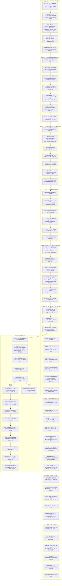

# WooZoo

```mermaid
flowchart TB
  %% =========================
  %% PHASE 0 - 아키텍처와 전체 설계
  %% =========================
  subgraph P0[PHASE 0 - 전체 아키텍처와 계획 수립]
    P0_1[요구 사항 정리 및 MVP 범위 정의<br/>개인용 토큰 과금형 AI 채팅 서비스]
    P0_2[핵심 기능 목록 정리<br/>회원 가입 로그인 채팅 세션 관리 토큰 사용량 저장 크레딧 차감]
    P0_3[기술 스택 확정<br/>Next.js 16 App Router TypeScript Tailwind shadcn<br/>Supabase Postgres Prisma Clerk Vercel AI SDK]
    P0_4[모노레포 구조 기획<br/>apps web apps api packages ui packages utils packages config]
    P0_5[브랜치 전략과 기본 규칙 정의<br/>main dev feature 브랜치 컨벤션 설정]

    P0_1 --> P0_2 --> P0_3 --> P0_4 --> P0_5
  end

  %% =========================
  %% PHASE 1 - 모노레포와 공통 개발 환경
  %% =========================
  subgraph P1[PHASE 1 - 모노레포와 공통 개발 환경 구축]
    P1_1[Git 저장소 초기화 및 GitHub 연동]
    P1_2[패키지 매니저 선택 및 설정<br/>bun 또는 pnpm workspace 설정]
    P1_3[Turborepo 구성<br/>루트 turbo 설정 캐시 빌드 테스트 파이프라인 정의]
    P1_4[TypeScript 공통 설정<br/>base tsconfig 생성 app 별 tsconfig 확장]
    P1_5[ESLint Prettier 설정<br/>Next TypeScript Tailwind 룰 추가<br/>format lint 스크립트 정의]
    P1_6[공통 env 구조 정의<br/>env example 파일 분리 Supabase Clerk OpenAI 키 위치 정의]
    P1_7[CI 기본 파이프라인 구상만 해두기<br/>테스트 빌드 lint 작업 정의]

    P1_1 --> P1_2 --> P1_3 --> P1_4 --> P1_5 --> P1_6 --> P1_7
  end

  %% =========================
  %% PHASE 2 - 데이터베이스와 Prisma 설계
  %% =========================
  subgraph P2[PHASE 2 - Supabase와 Prisma 기반 데이터 계층]
    P2_1[Supabase 로컬 실행 및 프로젝트 생성]
    P2_2[핵심 테이블 설계<br/>users credit_wallets chat_sessions chat_messages usage_logs]
    P2_3[Prisma schema 작성<br/>모든 테이블과 관계 정의]
    P2_4[Prisma migrate dev 실행<br/>로컬 Postgres에 스키마 적용]
    P2_5[Prisma client 생성 및 공통 prisma 인스턴스 파일 작성]
    P2_6[RLS 정책 구상<br/>각 user 자기 데이터만 조회 가능하도록 설계]
    P2_7[간단한 seed 스크립트 작성<br/>테스트용 사용자 세션 크레딧 생성]

    P2_1 --> P2_2 --> P2_3 --> P2_4 --> P2_5 --> P2_6 --> P2_7
  end

  %% =========================
  %% PHASE 3 - Clerk 인증과 유저 동기화
  %% =========================
  subgraph P3[PHASE 3 - Clerk 인증과 유저 동기화]
    P3_1[Clerk 프로젝트 생성 및 도메인 연결]
    P3_2[Next.js App Router에 Clerk 설정<br/>middleware 클라이언트 Provider 레이아웃 적용]
    P3_3[공개 페이지와 보호된 페이지 라우팅 규칙 정의]
    P3_4[유저 동기화 서버 액션 또는 웹훅 구현<br/>Clerk 유저가 생성될 때 users 테이블에 insert]
    P3_5[로그인한 유저 기준 current user 조회 유틸 함수 작성]
    P3_6[유저 생성 시 초기 크레딧 부여 로직 추가]

    P3_1 --> P3_2 --> P3_3 --> P3_4 --> P3_5 --> P3_6
  end

  %% =========================
  %% PHASE 4 - 크레딧과 사용량 도메인 로직
  %% =========================
  subgraph P4[PHASE 4 - 크레딧과 토큰 사용량 도메인 설계]
    P4_1[credit_wallets 테이블 상세 설계<br/>balance total_used last_charged_at 필드 정의]
    P4_2[usage_logs 테이블 설계<br/>세션별 모델별 토큰 단가와 사용량 기록]
    P4_3[크레딧 조회 서버 유틸 작성<br/>현재 로그인 유저 기준 balance 가져오기]
    P4_4[크레딧 차감 트랜잭션 함수 작성<br/>balance 감소 usage_logs 추가 chat_messages 저장 묶어서 처리]
    P4_5[크레딧 부족 시 에러 반환 규칙 정의<br/>예외 타입과 에러 메시지 통일]
    P4_6[테스트 코드 또는 스크립트로 트랜잭션 검증]

    P4_1 --> P4_2 --> P4_3 --> P4_4 --> P4_5 --> P4_6
  end

  %% =========================
  %% PHASE 5 - 채팅 API와 AI 모델 연동
  %% =========================
  subgraph P5[PHASE 5 - 채팅 API 구현과 Vercel AI SDK 연동]
    P5_1[AI 모델 설정 파일 작성<br/>기본 모델 OpenAI 또는 Google Gemini 등 구성]
    P5_2[Vercel AI SDK 통합<br/>streamText 또는 useChat 기반으로 선택]
    P5_3[채팅 API 라우트 초안 작성<br/>POST api chat 세션 ID 메시지 모델 파라미터 받기]
    P5_4[API에서 Clerk 인증 검증 후 유저 조회]
    P5_5[요청 전 크레딧 검증 로직 추가<br/>예상 최소 크레딧 기준 사전 체크]
    P5_6[AI 스트리밍 호출 구현<br/>프롬프트 구성 이전 메시지 포함 컨텍스트 생성]
    P5_7[스트리밍 도중 토큰 사용량 측정 또는 응답 후 대략 계산 로직 구현]
    P5_8[응답이 끝났을 때 트랜잭션으로 chat_messages usage_logs credit_wallets 업데이트]
    P5_9[에러 핸들링<br/>모델 에러 타임아웃 크레딧 부족 처리 공통화]

    P5_1 --> P5_2 --> P5_3 --> P5_4 --> P5_5 --> P5_6 --> P5_7 --> P5_8 --> P5_9
  end

  %% =========================
  %% PHASE 6 - 프론트엔드 채팅 플로우
  %% =========================
  subgraph P6[PHASE 6 - 프론트엔드 채팅 화면과 흐름]
    P6_1[루트 페이지 설계<br/>간단한 설명과 프롬프트 입력 폼]
    P6_2[프롬프트 제출 시 새 세션 생성 서버 액션 또는 API 호출]
    P6_3[세션 ID를 받아서 chat 세션 페이지로 라우팅<br/>채팅 URL chat 세션ID]
    P6_4[chat 페이지 레이아웃 구성<br/>좌측 세션 리스트 우측 채팅 메시지 영역]
    P6_5[useChat 또는 Assistant UI 통합<br/>메시지 전송과 스트리밍 응답 표시]
    P6_6[현재 크레딧 표시 컴포넌트<br/>서버에서 가져오거나 클라이언트에서 갱신]
    P6_7[세션 목록 컴포넌트<br/>최근 채팅 세션 DB에서 가져와 사이드바에 표시]
    P6_8[반응형 레이아웃 정리<br/>모바일에서 세션 리스트와 채팅 화면 전환 방식 정의]

    P6_1 --> P6_2 --> P6_3 --> P6_4 --> P6_5 --> P6_6 --> P6_7 --> P6_8
  end

  %% =========================
  %% PHASE 7 - 관리자 기능과 간단한 과금 플로우
  %% =========================
  subgraph P7[PHASE 7 - 관리자와 과금 준비]
    P7_1[관리자 플래그 필드 추가<br/>users 테이블에 is_admin 컬럼]
    P7_2[관리자 대시보드 라우트 생성<br/>총 사용자 수 총 사용량 간단 통계 보기]
    P7_3[관리자용 크레딧 충전 페이지 구현<br/>특정 유저 크레딧 수동 조정]
    P7_4[실제 결제 연동 전까지는 수동 충전으로 사용]
    P7_5[나중을 위한 결제 연동 설계 메모<br/>포인트당 금액 계산 환율 처리 전략 정리]

    P7_1 --> P7_2 --> P7_3 --> P7_4 --> P7_5
  end

  %% =========================
  %% PHASE 8 - 테스트와 배포 준비
  %% =========================
  subgraph P8[PHASE 8 - 테스트 정리와 배포]
    P8_1[핵심 도메인 유닛 테스트 작성<br/>크레딧 차감 로직 사용량 기록 로직]
    P8_2[채팅 API 통합 테스트<br/>모의 유저 세션으로 end to end 흐름 확인]
    P8_3[프론트엔드 기본 시나리오 테스트<br/>로그인 후 세션 생성 채팅 요청 크레딧 감소]
    P8_4[환경 분리<br/>로컬 개발 스테이징 프로덕션 env 구성]
    P8_5[Vercel에 Next.js 배포<br/>Supabase 프로덕션 프로젝트와 연결]
    P8_6[간단한 로그와 에러 모니터링 추가]

    P8_1 --> P8_2 --> P8_3 --> P8_4 --> P8_5 --> P8_6
  end

  %% =========================
  %% 채팅 요청 처리 로직 상세 플로우
  %% =========================
  subgraph CHAT[채팅 요청 처리 로직 상세]
    C1[사용자가 채팅 입력 폼에 메시지 작성 후 전송 클릭]
    C2[클라이언트 훅 또는 Assistant UI가 api chat 엔드포인트로 POST 요청<br/>세션 ID 유저 토큰 모델 정보 함께 전송]
    C3[API에서 Clerk 세션 검증<br/>유효하지 않으면 인증 에러 반환]
    C4[Prisma로 현재 유저 조회 및 credit_wallet 조회]
    C5[크레딧 부족 여부 검사<br/>부족하면 에러 코드와 메시지 반환]
    C6[이전 채팅 메시지를 DB에서 가져와 컨텍스트 구성<br/>필요시 최근 N개만 사용]
    C7[Vercel AI SDK streamText 호출<br/>모델과 메시지 리스트 전달]
    C8[스트림에서 토큰 사용량 집계 또는 응답 후 추정 값 계산]
    C9[응답이 끝나면 데이터베이스 트랜잭션 시작]
    C10[chat_messages 테이블에 유저 메시지와 모델 응답 메시지 저장]
    C11[usage_logs 테이블에 모델 이름 프롬프트 토큰 응답 토큰 단가 기록]
    C12[credit_wallets balance 감소 및 total_used 증가]
    C13[트랜잭션 커밋 후 최종 메시지를 스트림으로 클라이언트에 마무리 전송]
    C14[클라이언트에서 메시지 리스트 갱신 및 남은 크레딧 재조회 또는 낙관적 업데이트]

    C1 --> C2 --> C3 --> C4 --> C5
    C5 -->|충분함| C6 --> C7 --> C8 --> C9 --> C10 --> C11 --> C12 --> C13 --> C14
    C5 -->|부족함| C15[에러 토스트 또는 모달로 크레딧 부족 안내 후 입력 비활성화]
  end

  %% =========================
  %% PHASE 간 상위 흐름 연결
  %% =========================
  P0_5 --> P1_1
  P1_7 --> P2_1
  P2_7 --> P3_1
  P3_6 --> P4_1
  P4_6 --> P5_1
  P5_9 --> P6_1
  P6_8 --> P7_1
  P7_5 --> P8_1
  P5_3 --> C1
```

